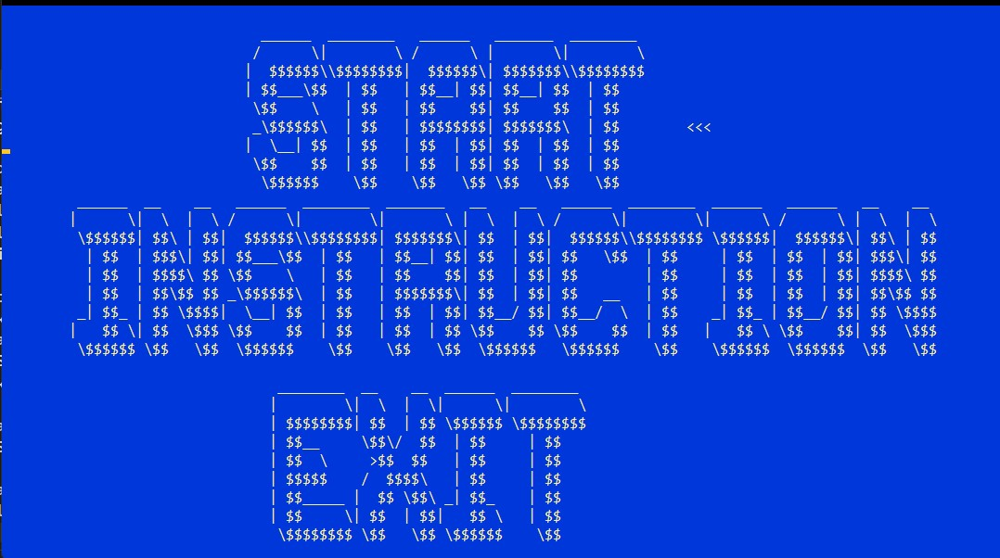
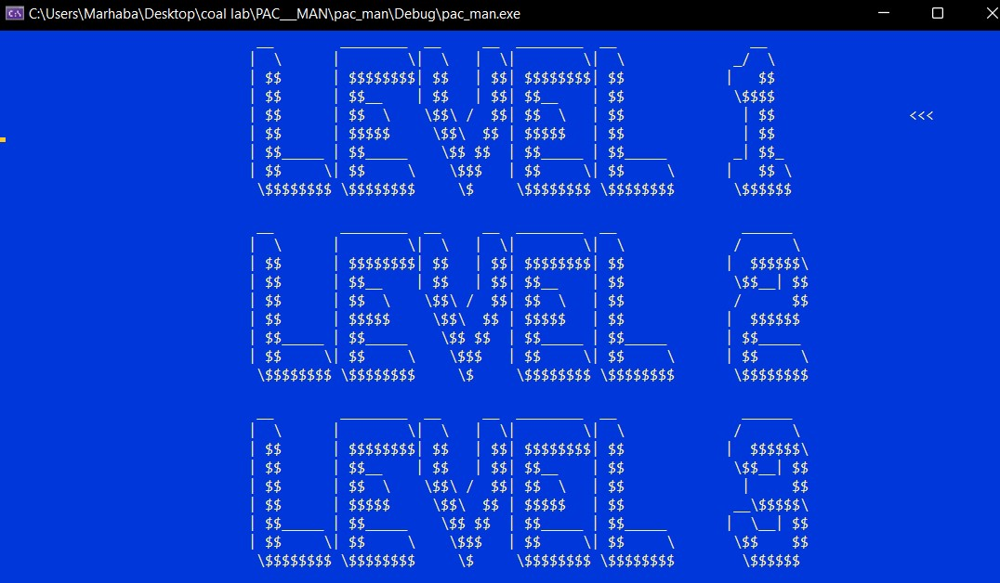
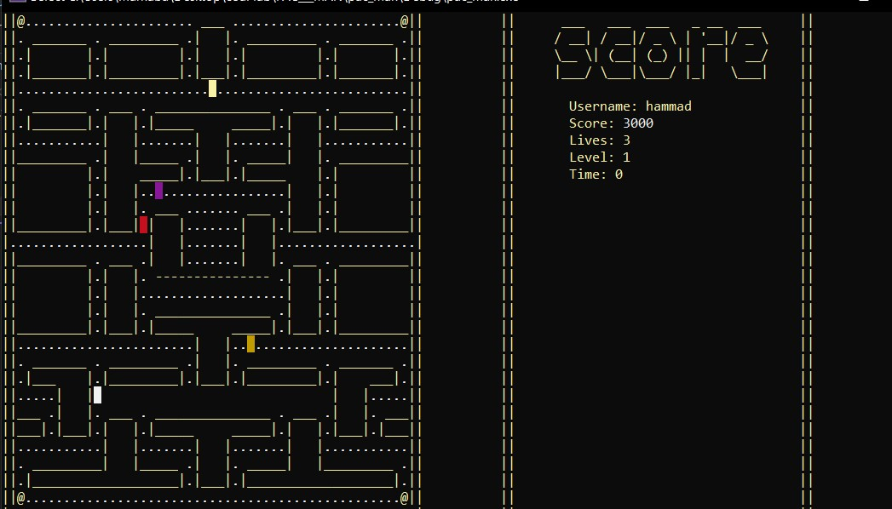
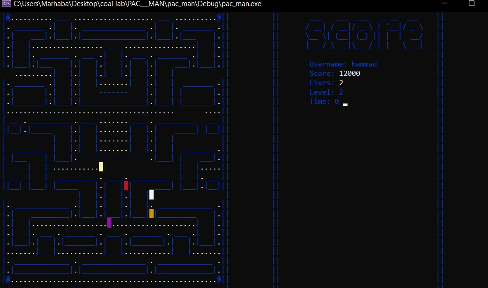
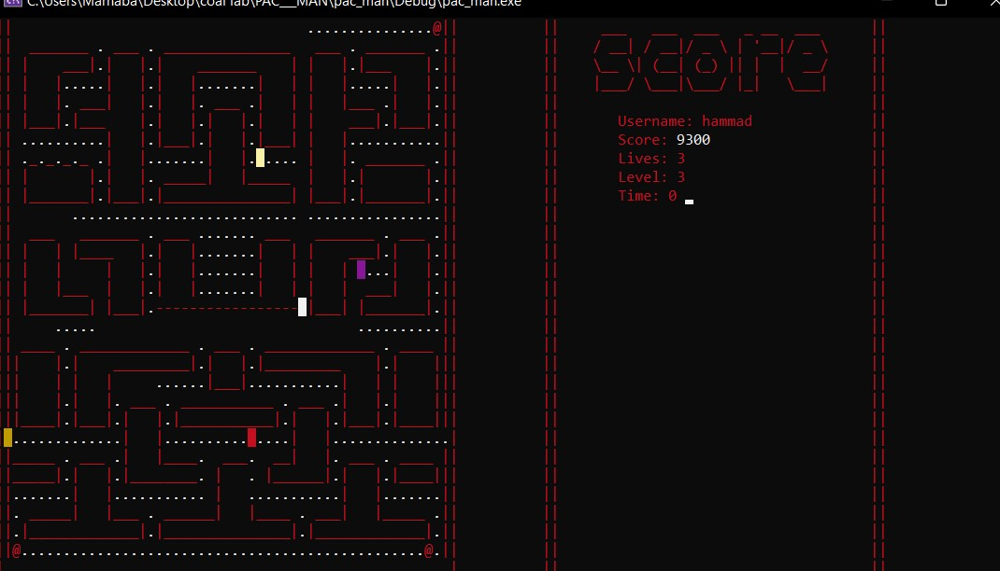
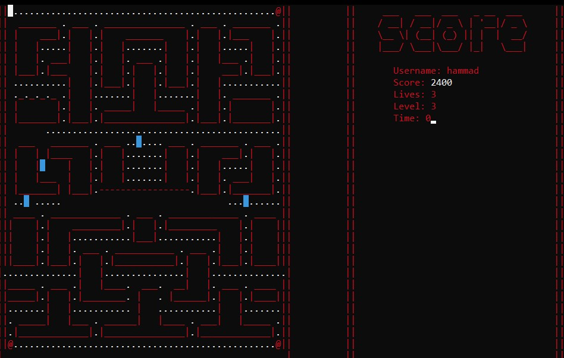

# Pac-Man (x86 Assembly - Irvine32)

A Pac-Man clone written in x86 assembly using the Irvine32 library. This project implements real AI movement for ghosts, smooth player controls, and an accurately aligned game grid.

---

## 🕹 Features

- **AI-Controlled Ghosts**: Ghosts intelligently move and chase Pac-Man.
    1. Blinky (Red) - Directly targets Pac-Man's current position.

    2. Pinky (Yellow) - Tries to ambush Pac-Man by aiming a few steps ahead.

    3. Inky (Magenta) - Uses a mix of Blinky's position and Pac-Man's direction to move unpredictably.

    4. Clyde (light brown) - Alternates between chasing and wandering away based on proximity to Pac-Man.
- **Smooth Movement**: Continuous motion without stuttering.
- **Collision Detection**: Proper wall and entity collisions.
- **Keyboard Controls**: Move Pac-Man in all directions using arrow keys.
- **Game Grid System**: Grid precisely aligned with the maze layout.
- **Manhattan Distance Heuristic**: Used for optimal pathfinding in a 
grid-based game.
- **Irvine32-Only**: No external libraries, only pure x86 assembly.
- **Scared Ghost**: Move away from pacman

---

## 🎮 Controls

- **Arrow Keys**: Up(w), Down(s), Left(a), Right(d)
- **Esc**: Exit the game

---
## 🔧 Setup & Installation
### Prerequisites:
- **Windows OS**
- **MASM** (Microsoft Macro Assembler)
- **Irvine32 Library** (Required for basic I/O and graphics handling)

### Installation Steps:
1. Install MASM and Irvine32.
2. Clone this repository:
   ```bash
   git clone https://github.com/AatifAli64/Pac-Man-Assembly-Edition.git

3. Open the project in a MASM-compatible IDE (e.g., Kip Irvine's MASM setup).
4. Compile and run the game.

---

## 📸 Preview
1. **Starting Screen**: Enter the name

2. **Second Screen** 
- **Start**: Start the game
- **Instruction**: Rules and Help
- **Exit**: Exit the Game

3. **Levels Screen**: There are **3** levels

4. **Level-1 Screen**

5. **Level-2 Screen**

6. **Level-3 Screen**

7. **Scared-Ghost Screen**

---
## 📜 Credits
Developed by **Aatif Ali Khan** as part of a low-level game programming challenge.

---
## 🏆 Learning Outcomes
This project demonstrates:

- Low-level game logic implementation in assembly.

- Efficient use of AI movement without high-level constructs.

- Direct memory manipulation for rendering game objects.

---
## 📌 Disclaimer
This is a fan-made project for learning purposes and is not affiliated with or endorsed by Namco.

---

## Enjoy the game! 👻
